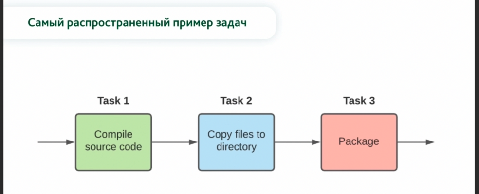
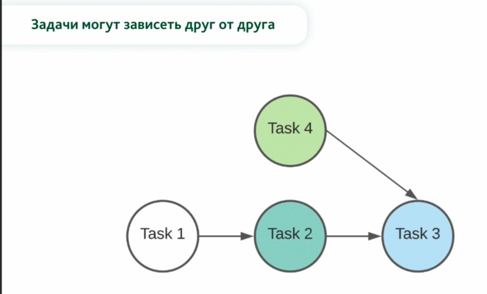
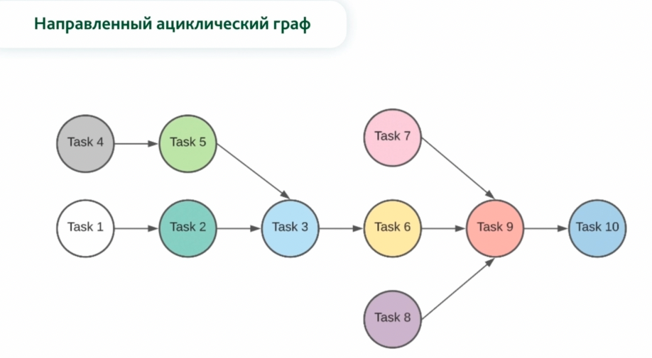
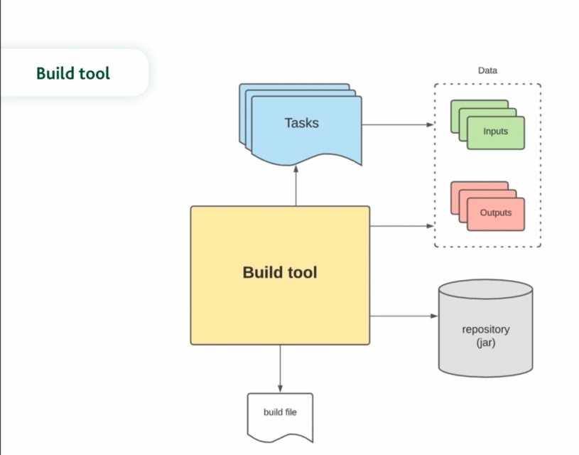

Build tool (инструмент сборки) - это программа для автоматизированного выполнения последовательности задач (task), 
    которая полностью управляет *жизненным циклом сборки проекта*

Task (задача) - это функция, которая принимает что-то на вход (input), выполняет какой-то объем работы с этими входными
    данными и выдает какой-то результат (output)

    Task1 - на вход мы получаем какие-то исходники, компилируем и на выходе скомпилированные файлы.
    Task2 - получает скомпилированные файлы и копирует в какую-то директорию. Например target
    Task3 - на основании этих скомпилированных файлов создает какой-то артефакт. Например jar

Эти таски зависят друг от друга, поэтому необходима какая-то последовательность:

    Тут таска3 зависит сразу от двух других: таска2 и таска4

    Ациклический граф - потому что мы можем выполнять некоторые задачи, которые не зависят от других, одновременно:
    4 и 1, 7 и 8

Чтобы построить такой циклический граф нашими билд инструментами, нужно где-то получить описание этих задач и зависимость
одной от другой. Все это происходить в Build file

Build file (файл сборки) - это инструкция, где описаны задачи, их зависимости, входные данные и т.д., которую может
    понимать build tool (инструмент сборки)

Gradle - это build tool (программа) для автоматизации сборки проектов, построенная на принципах Apache Ant 
    и Apache Maven, но предоставляющая более удобный DSL (Domain Specific Language) на языках Groovy (Kotlin)
    вместо XML формата. 
Первый релиз состоялся в 2007 году.
    
    Плюсы:
    - общая структура для всех проектов (convention over configuration)
    - поддерживает dependency managment
    - гибкий и легко расширяемый (tasks)
    - выразительный и декларативный build file (Groovy, DSL)
    Минусы:
    - более высокий порог вхождения (Groovy)