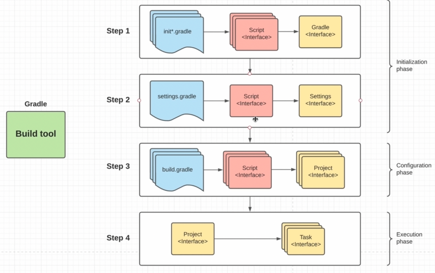

В Gradle три основных фазы:
    - Initialization phase
    - Configuration phase
    - Execution phase

    Step1: 
        1. Считывание всех init*.gradle файлов, которые находятся в /init.d в папке установленного gradle. Сейчас 
            папка пустая, но мы можем туда дописать какие-то крипты с расширением *.gradle. 
        2. Для каждого скрипта создается Script<Interface> имеющий полное соответствие скрипту .gradle
        3. И сколько бы у нас не было скриптов, они служать для инициализации одного единственного объекта Gradle<Interface>
            который содержит в себе сруктуру циклического графа и он строит его в себе постепенно шаг за шагом т.к. 
            сейчас на этом этапе он ничего не знает о проекте

    Step2:
        1. Считываем sittings.gradle если он существует. Он сучествует для того, чтобы проинициализировать все наши проекты
            в multi-project-build. Если у нас single-project-build то он нам и не нужен. По сути в нем описываются все 
            модули, которые мы должны подключить для нашего билда. Лежит в рутовой директории нашего проекта
        2. На основании этого файлика создается скрипт
        3. Скрипт служит для инициализации одного единственного объекта Sittings<Interface>

    Step3: 
        1. Теперь зная о всех проектах-модулях, которые нам нужно собрать мы знаем обо всех build.gradle файлах в этих
            проектах. Если sittings.gradle не было, то build.gradle будет лежать в корневой директории.
        2. Сколько у нас есть build.gradle файлов, столько создается скриптов
        3. Сколько build.gradle столько создается Project<Interface>

    Step4: Объект типа Project<Interface> запускает все свои Task<Interface> (внутри таскок Action<Interface>)

        