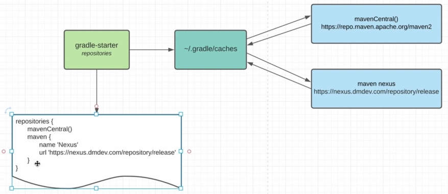

    repositories {
        // ~/.m2/repository
        mavenLocal()
        maven {
            name "nexus dmdev"
            uri "https://nexus.dmdev/repository"
        }
        mavenCentral()
        //flatDir{}
    }

Если мы не нашли нашу зависимость в mavenLocal, то мы идем в mavenCentral. Но можем добавить еще альтернативные к 
поиску места - maven{}. Теперь поиск такой: mavenLocal() - maven - mavenCentral()

Еще вариант добавить репозитоий находящийся на нашем локальном диске, но не рекомендуется: flatDir{}

Так же есть возможность через проперти указывать возможность не идти в удаленный репозиторий а искать в локальном 
~/.gradle/caches --offline  иесли не найдем, то будет exception

    